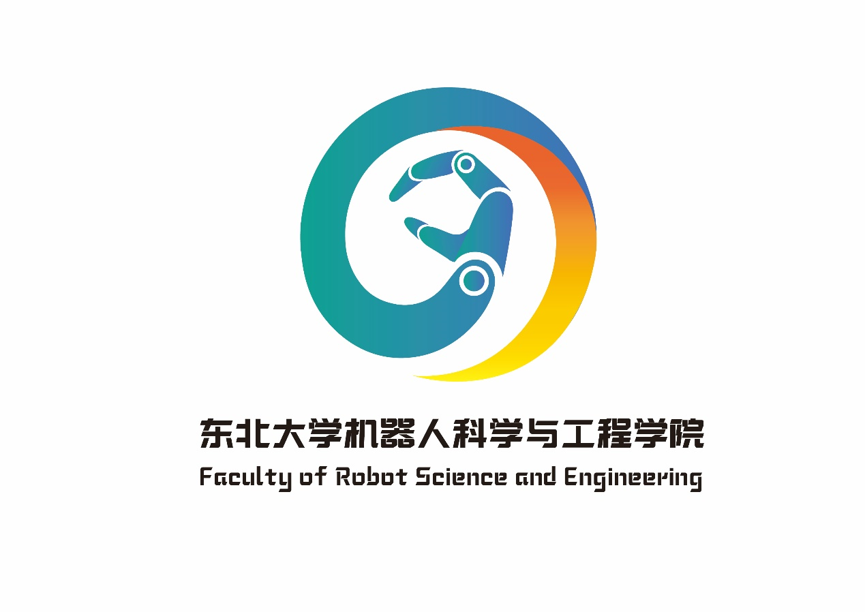

# 生活学习常见问题收集
**特别提醒：谨防诈骗，网上兼职不要相信，各种以学校名义或者其他名义的电话，一定要先核实（学校有可能会打电话了解一些情况），远离校园贷，各种推销不买最好，遇见QQ或者微信突然借钱的注意核实**

```
Ctrl + F 快速搜索
```

## 问题：宿舍怎么样？  
答：浑南校区宿舍均为4人寝，上床下桌，寝室条件不错，具体在哪个宿舍楼暂时不知道，宿舍没有空调，也没有电扇，现在夏天晚上不断电，平时是十一点断点熄灯，周末1点
并不能提前知道自己在哪个宿舍，也不能主动挑选室友，这些信息在开学当天宿舍门口会张贴表格。（18级是这样的）


## 问题：食堂怎么样？  
答：浑南暂时只有一个食堂，三层，每层有电梯，环境不错，吃饭正常10元左右（中餐，晚餐）。第二个食堂正在建

## 问题：运动场地怎么样？  
答：浑南校区有一个室内体育场——风雨操场，有跑步机等器材，浑南免费开放，室外体育场修建完毕
  
## 问题：可以带电脑吗？该买什么样的电脑？  
答：
（1）学校没有规定禁止大一带电脑，在大一有一些作业需要用到电脑，比如c语言作业以及mooc作业的批改。课下自己想自学编程，单片机也需要电脑，建议开学就带上电脑。学校有机房，但机房有时有班级上课，图书馆有公共电脑，可以满足mooc作业批改的需求，但没有什么软件，c语言作业会不太方便  
（2）机器人这个专业需要安装各种软件，有些大型软件一个就需要40g，所以买电脑需要一个大硬盘，建议固态加机械组合（ssd+1T机械），固态做为系统盘，开机速度快，运行内存8g，cpu显卡尽量买好的，量力而行
  
## 问题：机器人专业学什么？  
答：大一为公共基础课，各学院所学相近（不是完全一样），因此在大二的时候转专业影响不大，具体学啥可以参考培养计划  

## 问题：学生组织与社团有啥区别？  
答：学生组织与社团是不一样的，学生组织有东北大学共青团委员会统一管理，社团由社联管理，具体的学生组织与社团名单参考群文件内容，重要的是学生组织成员（不同等级加分不同）享受德育分加分，社团只有社长可以加分
 
## 问题：英语分级是怎么回事？  
答：从16级开始，东北大学实行大类招生，以四级考试成绩作为分班标准，大一上学期不分级，大一下分级，18级是540+ 425（过四级的分数）到540                      以及425以下三类 

## 问题：四六级考试有啥要求吗？  
答：东北大学对四六级考试不设报考条件，想考就考，不过四级过了才能考六级，不能同时报（教育部规定的），报名的时候会通知，以班级为单位报名

## 问题：我从哪里能了解到官方的消息？  
答：[东北大学官网：http://www.neu.edu.cn/](http://www.neu.edu.cn/)  
[东北大学教务处官网：https://aao.neu.edu.cn/](https://aao.neu.edu.cn/)  
[东北大学机器人学院官网：http://www.rse.neu.edu.cn/](http://www.rse.neu.edu.cn/)   
东北大学官方微信，官方微博  
东北大学团委官方微信，官方微博  
东大机器人官方微信，官方微博  
东北大学招生办官方微信  

## 问题：怎么购买火车票学生票？  
答：大一第一次来学校只能拿着录取通知书去火车站窗口购买，以后可以网上购买


## 问题：报到在哪里  
答：迎新当天校园内会有摊位 搭的帐篷，一排排的，过去可以找到咱学院吖


## 机器人学院院徽


## 机器人学院院训

**博学笃行 求是创新 学以致用 与时俱进** 


## 文件列表(国内Gitee)

- 常见问题收集
    - [NEU-RSE.png](https://gitee.com/wisfly/NEU-RSE-Courses/raw/master/常见问题收集/NEU-RSE.png)


## 文件列表(Github)

- 常见问题收集
    - [NEU-RSE.png](https://github.com/mywisdomfly/NEU-RSE-Courses/raw/master/常见问题收集/NEU-RSE.png)
